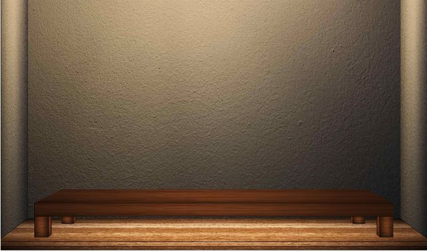
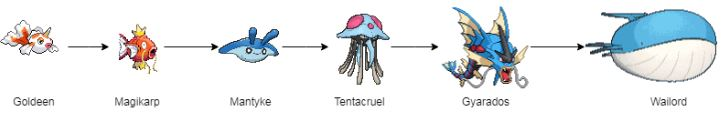
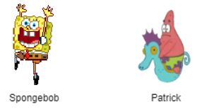
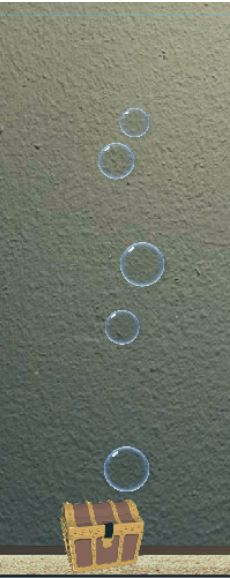

# CG-Fish-Tank-Java
The project was created for my university computer graphics course. It was written in Java. Feel free to explore it!

The whole program was written from scratch without importing source code from any online resources. However, most of the animated objects within the fish tank use gif images obtained from the Internet, such as the Pokemon, seaweed and treasure chest. With Java 2D graphics, a beautiful yet innovative fish tank was created.

The whole aquarium design is made to be as realistic as possible by imitating perspective projection when viewing the aquarium and its surroundings. 

    

## Introduction
### Environment Setup
When the program is run, the fish tank is filled with a random number of fish. The user can choose to adjust the following settings (these will be explained in more detail in the following sections):
- Toggle fish health - Control the health display of the fish. 
- Toggle fish sense - Control the ability of fish to detect and swim towards fish food.
- Toggle monster - Control the appearance of monsters to catch the fish.

    

### Fish
The fish design is inspired by the famous game, Pokemon. Several of the fish’ characteristics are derived from this game, such as the ability to evolve, and the fish images are actually the designs of several water-type Pokemon.
- Each fish has a finite health level which decreases slowly over time and can be regenerated by feeding the fish. This is similar to the act of feeding fish in real life. This function, however, is disabled by default and can be enabled through the advanced control menu.
- Each fish is capable of growth by feeding.

    

### Monster 
The monster designs are taken from the popular kids cartoon, Spongebob Squarepants. The sole function of the Monster is to catch any fish that come their way. This function is enabled by default. 

    

### Bubbles
To add effect, bubbles are created from time to time in the fish tank. It is designed in a way that the bubbles are produced from the opening and closing of the treasure chest located at the bottom left corner of fish tank. 
- Bubbles of smaller size will float at a faster speed towards the water surface whereas bubbles of bigger size will float slower. 
- Once the bubbles reach the water surface, they will just vanish.

    

### Remarks
This whole project was conducted in a team of three. My teammates are Chee Sue Sien and Teh Li Han.
